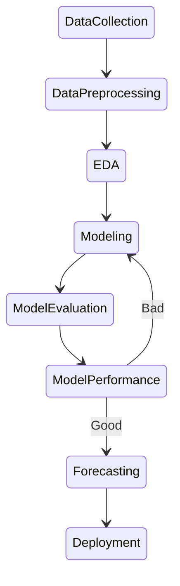

# Stock Price Forecasting

In this project, our primary focus was on forecasting the closing price of stocks for the next trading day through an analysis of historical stock price data. Initially, we implemented Long Short-Term Memory (LSTM) to capture short-term patterns and forecast the day's closing prices. Additionally, we utilized feature engineering techniques, incorporating the previous day's [open, high, low, close, volume] as input features for predicting the current day's close price. This approach effectively captured short-term trends. Currently, our aim is to enhance the model's capabilities by exploring various deep learning and traditional machine learning techniques, along with further feature engineering on the data.

## Dataset

- Source: [Yahoo Finance](https://in.search.yahoo.com/?fr2=inr)

Initially, we used the last 12 years' stock price data of Amazon. We split this dataset into the below category

#### Train: 2010 - 2020

#### Validation: 2021 - 2021

#### Test: 2022 - 2022

## Workflow

## Hyperparameter Tuning
We tried lots of configurations for our LSTM architecture below we show our top 5 (based on validation loss)
| Epochs | LSTM Units | Optimizer |Val Loss|
|--------|------------|-----------|--------|
|   130  |    150     |   Adam    | 0.0083 |
|   140  |    100     |   Adam    | 0.0086 |
|   100  |    100     |   Adam    | 0.0090 |
|   120  |    100     |   Adam    | 0.0101 |
|   90   |    100     |   Adam    | 0.0302 |

Best Hyparameters (based on low MSE): 90, 100, Adam

Best Hyparameters for Random Forest

| Hyperparameter      | Value |
|---------------------|-------|
| max_depth           | 20    |
| max_features        | sqrt  |
| min_samples_leaf    | 2     |
| min_samples_split   | 5     |
| n_estimators        | 200   |
| random_state        | 42    |

Best Hyparameters for XGBoost

| Hyperparameter      | Value |
|---------------------|-------|
| colsample_bytree    | 0.8   |
| gamma               | 0     |
| learning_rate       | 0.05  |
| max_depth           | 7     |
| min_child_weight    | 3     |
| n_estimators        | 200   |
| reg_alpha           | 0     |
| reg_lambda          | 0     |
| subsample           | 1.0   |

## Result
| Model | RMSE | MAE |
|--------|----------|----|
| LSTM   | 370.610 | 300.813 |
| Random Forest | 174.842 | 55.107 |
| XGBoost | 196.178 | 73.491 |
| Random Forest + XGBoost | 170.651 | 51.105 |

## Prediction on Test Data
LSTM

Random Forest

XGBoost

Random Forest + XGBoost

## Acknowledgements

 - [Machine Learning Mastery](https://machinelearningmastery.com/persistence-time-series-forecasting-with-python/)

